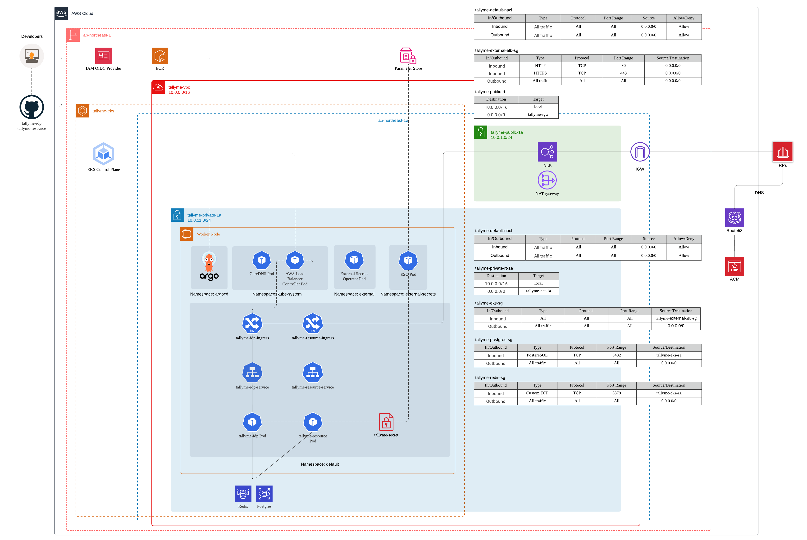

# tallyme-dev


Dev environment for
- https://idp.tallyme.xyz (accessible by https://tallyme-idp.localhost)
- https://resource.tallyme.xyz (accessible by https://tallyme-resource.localhost)

## Prerequisites

- [Minikube](https://minikube.sigs.k8s.io/)
- [kubectl](https://kubernetes.io/docs/tasks/tools/)
- Docker

## Make commands

| Command | Description |
|---------|-------------|
| `make apply` | Full setup: start Minikube and deploy all resources |
| `make colima` | Start Colima (Docker runtime) |
| `make hosts` | Configure `/etc/hosts` for local DNS (`*.localhost`) |
| `make setup` | Start Minikube with the Docker driver, enable the Ingress addon, and open a `minikube tunnel` window |
| `make deploy` | Create the Postgres ConfigMap and apply all Kubernetes manifests (Postgres, Redis, IdP, Resource) |
| `make stop` | Stop the Minikube cluster |
| `make destroy` | Delete the Minikube cluster (prompts for confirmation) |
| `make psql` | Open a psql session against the in-cluster Postgres |

## Quick start

```bash
# Bring up the entire dev environment
make apply

# Stop the cluster (keeps all data/config)
make stop

# Destroy the cluster entirely
make destroy
```

## Production architecture on AWS



## Related repositories

- https://github.com/xyzsince2014/tallyme-idp
- https://github.com/xyzsince2014/tallyme-resource
